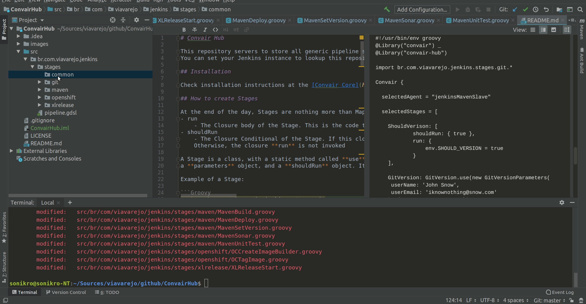

# Convair Hub

This repository servers to store all generic pipeline stages. 
You can set your Jenkins instance to lookup this repository as a Global Library, and so you can reuse all the existing code from this repository.

## Installation

Check installation instructions at the [Convair Core](https://github.com/viavarejo/convair) repository.

## How to create Stages

At the end of the day, Stages are nothing more than Maps with the following information:
- run
    - The Closure body of the Stage. This is the code that gets executed for the Stage
- shouldRun
    - The Closure Conditional of the Stage. If this closure returns **true**, then the **run** closure gets executed.
    Otherwise, the closure **run** is not invoked
    
A Stage is a class, with a static method called **use**, that receives in the constructor,
a **parameters** object, and a **shouldRun** object. It's recommended that they both define a default value

Example of a Stage:

```Groovy
package br.com.viavarejo.jenkins.stages.git

class GitVersionParameters {
    String credentialsId
    String userEmail
    String userName
}

class GitVersion {

    static def use(
            GitVersionParameters parameters = new GitVersionParameters(
                    credentialsId: 'git',
                    userEmail: 'jenkins@jenkins.com.br',
                    userName: "Jenkins"
            ),
            Closure shouldRun = { env.SHOULD_DEPLOY }) {
        return [
                run      : {
                    withCredentials([usernamePassword(credentialsId: parameters.credentialsId, passwordVariable: 'GIT_PASSWORD', usernameVariable: 'GIT_USERNAME')]) {
                        sh "git config --global user.email '${parameters.userEmail}'"
                        sh "git config --global user.name '${parameters.userName}'"
                        sh "git add -A"
                        sh "git commit --no-verify -m '${env.VERSION} [skip ci]'"
                        sh "git tag -a ${env.VERSION} -f -m '${env.VERSION} [skip ci]'"
                        sh "git push http://${GIT_USERNAME}:${GIT_PASSWORD}@${env.PROJECT_REPO} --tags"
                        sh "git push http://${GIT_USERNAME}:${GIT_PASSWORD}@${env.PROJECT_REPO} HEAD:${env.BRANCH_NAME}"
                    }
                },
                shouldRun: shouldRun
        ]
    }
}
```

This stage can be consumed in the Jenkinsfile, as such:

#### Using stage with default parameters and conditional
```groovy
#!/usr/bin/env groovy
@Library("convair") _
@Library("convair-hub")

import br.com.viavarejo.jenkins.stages.git.*

Convair {
  
  selectedAgent = "jenkinsMavenSlave"
  
  selectedStages = [
    
    GitVersion: GitVersion.use()

  ]
}
```

#### Using stage with different parameters and default conditional

```groovy
#!/usr/bin/env groovy
@Library("convair") _
@Library("convair-hub")

import br.com.viavarejo.jenkins.stages.git.*

Convair {
  
  selectedAgent = "jenkinsMavenSlave"
  
  selectedStages = [
    
    GitVersion: GitVersion.use(new GitVersionParameters(
     userName: 'John Snow',
     userEmail: 'iknownothing@snow.com'
    ))

  ]
}
```

#### Using stage with different parameters and different conditional
```groovy
#!/usr/bin/env groovy
@Library("convair") _
@Library("convair-hub")

import br.com.viavarejo.jenkins.stages.git.*

Convair {
  
  selectedAgent = "jenkinsMavenSlave"
  
  selectedStages = [
  
    ShouldVerison: [
            shouldRun: { true },
            run: {
                env.SHOULD_VERSION = true
            }
    ],
    
    GitVersion: GitVersion.use(new GitVersionParameters(
     userName: 'John Snow',
     userEmail: 'iknownothing@snow.com'
    ), { env.SHOULD_VERSION })

  ]
}
```

# Using File Templates for IntelliJ

If you're using IntelliJ, you can create a new **ConvairStage** using the File Template provided
with this project.


## Contributing
Pull requests are welcome. For major changes, please open an issue first to discuss what you would like to change.
